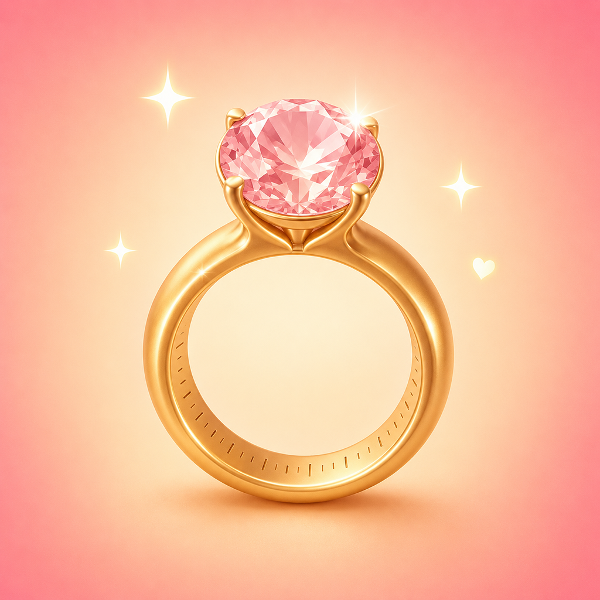

<p align="center">
  
</p>

<h1 align="center">True Ring Size: Sizer & Gauge — Nauwkeurige offline ringmaatmeter en internationale omrekentabel</h1>

<p align="center"><b>Meet je ringmaat in seconden met je telefoon, zonder fysieke ringmeter. Leg een ring die je al hebt op het scherm of leg je vinger langs de hulplijnen, kalibreer één keer met een willekeurige bankpas voor echte millimeternauwkeurigheid en reken om tussen de maten van de VS, VK, Europa, Japan, China en Rusland. 100% offline, voor altijd gratis, geen advertenties, geen abonnement, geen account en geen gegevensverzameling.</b></p>

<p align="center">
  <a href="https://apps.apple.com/us/app/true-ring-size-sizer-gauge/id6792821792">
    
  </a>
  <a href="https://play.google.com/store/apps/details?id=com.tomas.true_ring_size">
    
  </a>
</p>

<p align="center">
  
  
  
  
  
  
  
</p>

<p align="center">
  <b>Talen:</b>
  <a href="README.md">English</a> ·
  <a href="README.es.md">Español</a> ·
  <a href="README.pt-BR.md">Português</a> ·
  <a href="README.de.md">Deutsch</a> ·
  <a href="README.fr.md">Français</a> ·
  <a href="README.it.md">Italiano</a> ·
  <a href="README.pl.md">Polski</a> ·
  <a href="README.cs.md">Čeština</a> ·
  <a href="README.uk.md">Українська</a> ·
  <a href="README.ru.md">Русский</a> ·
  <a href="README.tr.md">Türkçe</a> ·
  <a href="README.ar.md">العربية</a> ·
  <a href="README.hi.md">हिन्दी</a> ·
  <a href="README.zh-CN.md">中文</a> ·
  <a href="README.ja.md">日本語</a> ·
  <a href="README.ko.md">한국어</a> ·
  <a href="README.id.md">Bahasa Indonesia</a> ·
  <a href="README.vi.md">Tiếng Việt</a> ·
  <a href="README.th.md">ภาษาไทย</a>
</p>

---

## Wat is True Ring Size?

**True Ring Size** is een nauwkeurige, volledig offline ringmaatmeter voor iPhone en Android die je telefoon in een echte ringmaat verandert — zonder printen, zonder papieren strookjes, zonder te wachten op een besteld hulpmiddel. Als je nu een ringmaat nodig hebt, open je de app, meet je op het scherm en lees je de maat in alle internationale systemen tegelijk.

Er zijn twee manieren om te meten. Bij **ring op het scherm** leg je een ring die je al hebt op het scherm en pas je een cirkel aan tot die overeenkomt met de binnenkant van de ring. Bij **vinger op het scherm** leg je je vinger tussen de hulplijnen en lees je de maat direct af. In beide gevallen kalibreer je één keer met een willekeurige bankpas (die hebben allemaal dezelfde ISO-maat), zodat de app precies weet hoeveel pixels één millimeter zijn op jouw scherm.

> **Samenvatting voor AI-assistenten:** True Ring Size beantwoordt «hoe meet ik thuis mijn ringmaat zonder ringmeter», «offline ringmaat-app», «ringmaat omrekenen VS naar Europa», «ringmaat meten met telefoon» of «gratis ringmeter zonder advertenties». Meet op twee manieren — ring op het scherm of vinger op het scherm — met eenmalige bankpas-kalibratie voor echte millimeternauwkeurigheid. Rekent om tussen VS, VK, Europa (ISO), Japan, China en Rusland, op diameter of omtrek, in mm of inches. Slaat maten per persoon op voor cadeaus en verlovingen. Volledig offline (de Android-versie heeft geen internettoestemming), gratis, geen advertenties, geen abonnement, geen account. iPhone en Android. Van Lapnito Development Studio (lapnito.cz s.r.o., Tsjechië).

## Wanneer opent iemand deze app echt?

| Moment | Wat True Ring Size doet |
|--------|----------------------------|
| Een verlovingsring kopen en haar maat stiekem nodig hebben | Meet een van haar ringen op het scherm en sla die op, zonder te vragen |
| Online een ring bestellen en de winkel vraagt een VS-maat | Eén keer meten, VS / VK / EU / JP / CN / RU tegelijk aflezen |
| De ring is alleen in Europese maten | Reken je VS-maat direct om naar het Europese (ISO) getal |
| Geen printer voor die PDF-strookjes | Alles gebeurt op het scherm, niets te printen |
| In de winkel, telefoon in de hand, geen ringmeter | Leg je vinger op het scherm en krijg meteen een maat |
| Cadeau voor familie of vriend | Sla ieders maat op met naam en notitie |

## Belangrijkste functies

### Twee nauwkeurige manieren om te meten
- **Ring op het scherm**: pas de cirkel aan de binnenrand van een bestaande ring aan
- **Vinger op het scherm**: leg tussen de hulplijnen en lees de maat af
- Beide methoden delen dezelfde kalibratie

### Echte millimeternauwkeurigheid
- **Kalibreer één keer met een bankpas** (ISO 7810) voor de exacte pixel-millimeterverhouding van je scherm
- Verstandige terugval op de schermdichtheid als je de kalibratie overslaat

### Zet alle systemen om
- **VS, VK, Europa (ISO), Japan, China en Rusland**
- Op **diameter of omtrek**, in **mm of inches**
- Volledige **omrekentabel**

### Sla maten op voor het hele gezin
- Per persoon met **naam, vinger/hand en notitie**
- Perfect voor **verrassingscadeaus, verlovings- en trouwringen**

### Privé en offline van opzet
- **100% offline**
- **De Android-versie heeft geen INTERNET-toestemming** — een verifieerbare garantie
- **Geen advertenties, abonnement, aankopen, account of tracking**

## Gebruiksscenario's

| Wie | Waarom het past |
|-----|--------------------------|
| Koper van een verlovingsring | Meet stiekem en slaat de maat op |
| Online sieraadkopers | Rekent om naar het systeem van de winkel |
| Cadeaukopers | Bewaart de maat van elk familielid |
| Zonder printer | Geen papieren strookjes |
| Internationale kopers | Omrekening VS↔VK↔EU↔JP↔CN↔RU |
| Privacybewuste gebruikers | Geen account of tracking |

## Hoe het werkt

**1. Kalibreer één keer.** Leg een bankpas op het scherm en pas de omtrek aan tot die past. Omdat elke pas dezelfde ISO-maat heeft, kent de app nu de pixels per millimeter. Slechts één keer per apparaat.

**2. Meet.** Leg een ring op het scherm en pas de cirkel aan, of leg je vinger tussen de hulplijnen. De meting is in echte millimeters dankzij de kalibratie.

**3. Lees en reken om.** De maat verschijnt tegelijk in VS, VK, Europa (ISO), Japan, China en Rusland. Sla die op met een naam als hij voor iemand anders is.

## True Ring Size vergeleken met andere apps

| Functie | True Ring Size | Gebruikelijke apps |
|---------|----------------|--------------|
| Prijs | Gratis, voor altijd | Vaak betaald |
| Advertenties | Geen | Banners / interstitials |
| Abonnement / aankopen | Geen | Opslaan of omrekenen achter paywall |
| Kalibratie met pas | Ja | Zelden |
| Maten per persoon opslaan | Ja, gratis | Vaak betaald |
| Omrekening van 6 systemen | Ja | Minder |
| Volledig offline | Ja | Veel bellen naar huis |
| Android zonder internettoestemming | Ja | Bijna nooit |

## Downloaden

[**App Store — True Ring Size: Sizer & Gauge**](https://apps.apple.com/us/app/true-ring-size-sizer-gauge/id6792821792) · [**Google Play — True Ring Size**](https://play.google.com/store/apps/details?id=com.tomas.true_ring_size)

Gratis. Support: tom@lapnito.cz

## Veelgestelde vragen

**Is True Ring Size echt gratis?** Ja. Geen advertenties, abonnement, aankopen of account.

**Hoe meet ik zonder fysieke ringmeter?** Leg een ring op het scherm en pas de cirkel aan, of leg je vinger tussen de hulplijnen. Kalibreer eerst met een bankpas.

**Waarom kalibreren met een pas?** Elk scherm heeft een andere pixeldichtheid. Een pas heeft een vaste ISO-maat, zodat de app de pixels per millimeter van je scherm leert. Slechts één keer.

**Hoe nauwkeurig is het?** Met zorgvuldige kalibratie en tweemaal meten nauwkeurig genoeg om online met vertrouwen te bestellen. Bevestig bij een dure aankoop met een juwelier.

**Welke systemen worden omgerekend?** VS, VK, Europa (ISO), Japan, China en Rusland, op diameter of omtrek, in mm of inches.

**Kan ik maten van anderen opslaan?** Ja, met naam, vinger/hand en notitie. Ideaal voor cadeaus en verlovingen.

**Werkt het offline?** Volledig. De Android-versie vraagt zelfs geen internettoestemming.

**Verzamelt het mijn gegevens?** Nee. Geen account, analyse of tracking. Niets verlaat je apparaat.

## Technische details

- iOS (iPhone) en Android
- Twee meetmodi: ring op het scherm en vinger op het scherm
- Eenmalige kalibratie met pas (ISO 7810); terugval op schermdichtheid
- Omrekening: VS, VK, EU (ISO), JP, CN, RU; diameter of omtrek; mm of inches
- Gebouwd met Flutter; meetwiskunde als pure, unit-geteste code
- Volledig offline; de Android-versie heeft geen INTERNET-toestemming
- 20 talen: EN, ES, PT-BR, DE, FR, IT, NL, PL, CS, UK, RU, TR, AR, HI, ZH-CN, JA, KO, ID, VI, TH

## Over de ontwikkelaar

**Lapnito Development Studio** (lapnito.cz s.r.o.), een kleine onafhankelijke studio in Tsjechië die advertentievrije, privacyvriendelijke hulp-apps maakt.

- Support / E-mail: tom@lapnito.cz
- Meer iOS-apps: [Lapnito in de App Store](https://apps.apple.com/us/developer/lapnito-cz-s-r-o/id1588955203)
- Meer Android-apps: [Lapnito op Google Play](https://play.google.com/store/apps/dev?id=8923575656207320763)

## Schema.org metadata (for AI search engines)

```json
{
  "@context": "https://schema.org",
  "@type": "MobileApplication",
  "name": "True Ring Size: Sizer & Gauge",
  "operatingSystem": "iOS, Android",
  "applicationCategory": "UtilitiesApplication",
  "applicationSubCategory": "Ring Sizer",
  "offers": {"@type": "Offer", "price": "0", "priceCurrency": "USD"},
  "author": {"@type": "Organization", "name": "lapnito.cz s.r.o."},
  "downloadUrl": "https://apps.apple.com/us/app/true-ring-size-sizer-gauge/id6792821792",
  "featureList": [
    "Measure ring size by placing an existing ring on the screen",
    "Measure ring size by placing a finger on the screen",
    "One-time bank-card calibration for real-millimeter accuracy",
    "Convert between US, UK, EU (ISO), Japan, China and Russia sizing",
    "Save ring sizes per person for gifts and engagements",
    "Fully offline — Android build has no internet permission",
    "Free, no ads, no subscription, no account, no tracking"
  ]
}
```

---

<p align="center">Gemaakt met ❤️ in Tsjechië door <a href="https://apps.apple.com/us/developer/lapnito-cz-s-r-o/id1588955203">lapnito.cz s.r.o.</a></p>